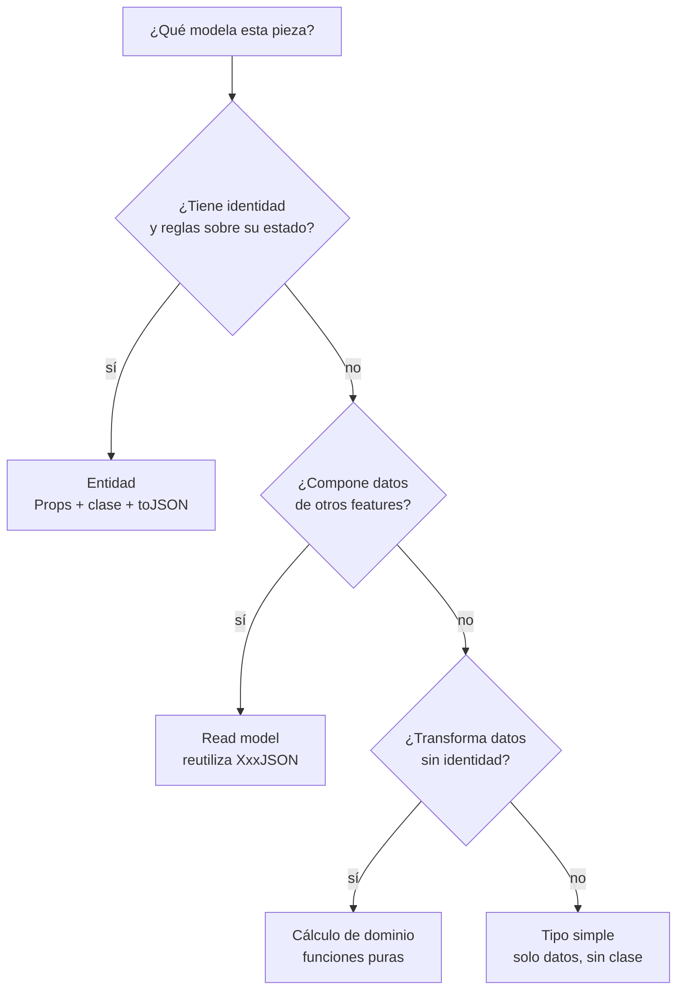
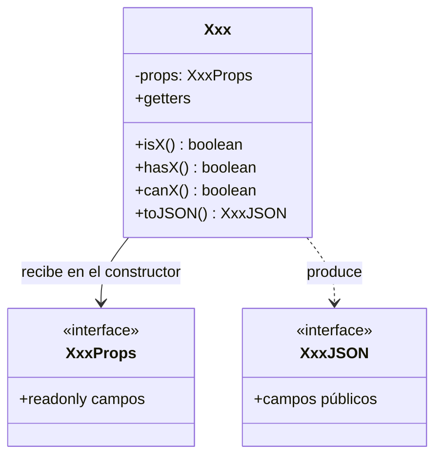

# Patrón de dominio — multicard-api

Este documento define **cómo se modela la capa de dominio** (`features/<feature>/domain/`). Complementa a [`resumen-arquitectura.md`](./resumen-arquitectura.md), que explica las capas; aquí se explica qué piezas puede contener el dominio y cuándo usar cada una.

## El problema

Hoy cada feature modela su dominio de una forma distinta, sin una regla escrita que lo justifique:

| Feature | Cómo modela el dominio hoy | Observación |
| --- | --- | --- |
| `customer` | Entidad (`Customer`) con 6 métodos de comportamiento (`isCardValid`, `isPhoneValid`, `isApproved`, `hasBalance`, `hasMulticard`, `belongsToSubsidiary`), getters y `toJSON()` / `toDetailJSON()` | Es el único feature con una entidad con reglas |
| `installment` | Funciones puras (`buildAmortizationTable`, `buildSimpleAmortization`, `getNextMonthDate`, `isMinorDayLimit`) e interfaces con prefijo `I` | Los tipos de datos usan el prefijo `I` (`IInstallmentInput`, `IInstallmentResult`) y `IInstallmentCalculated` repite la forma de `AmortizationRow` |
| `invoice` | Clase `Invoice` con solo 3 getters y `toJSON()` | `InvoiceJSON` es idéntico a `InvoiceProps`; la clase no aporta comportamiento |
| `sales-order` | Solo tipos | Los tipos `InvoiceSummary`, `CustomerSummary` e `InstallmentSummary` duplican formas que ya existen en otros features |

La consecuencia es que un feature nuevo no tiene una referencia clara, y la revisión de código discute estilo en lugar de negocio.

## Idea central

**No todo en el dominio tiene que ser una clase.** El dominio se compone de tres tipos de pieza y cada feature usa la que corresponde a lo que modela. Un feature puede combinar más de una.

### 1. Entidad

Un objeto con **identidad** y con **reglas sobre su propio estado**.

- `XxxProps`: los campos, todos de solo lectura.
- Una clase con `props` privado y de solo lectura, getters para lo que se expone y métodos de comportamiento con nombre `isX`, `hasX` o `canX`.
- `toJSON(): XxxJSON` para la salida pública.

Ejemplos: `Customer`, y `Invoice` si llega a tener reglas propias.

### 2. Cálculo de dominio

Una transformación pura **sin identidad**: recibe datos, devuelve datos.

- Funciones exportadas, puras, con tipos de entrada y salida explícitos.
- Si depende del tiempo, la fecha de referencia se inyecta como parámetro opcional para que el resultado sea determinista en los tests.

Ejemplo: la amortización de `installment` (`buildAmortizationTable`, `getNextMonthDate`).

### 3. Read model

Una **proyección que compone datos de otros features** para armar una respuesta. No tiene reglas ni identidad propia.

- Sus tipos **reutilizan** los `XxxJSON` de los features de origen. Se admite derivar una variante con `Pick` u `Omit` cuando solo se necesita un subconjunto.
- No se redefinen formas que ya existen en otro feature.

Ejemplo: el resumen de orden de venta de `sales-order`.

### Cómo elegir la pieza

Si una clase solo tiene getters y `toJSON()`, sin ninguna regla, probablemente es un tipo simple y no una entidad.

### Forma de una entidad

## Convenciones comunes

- **Prefijo `I` solo para puertos.** `ICustomerRepository` lleva `I`; los tipos de datos no (`InstallmentInput`, no `IInstallmentInput`).
- **Quién es dueño de cada tipo.** El dominio define `XxxProps` y `XxxJSON`; el caso de uso define `XxxInput` y `XxxOutput`.
- **Orden fijo del archivo de dominio:** constantes, tipos, entidad y, al final, funciones puras.
- **Las reglas de negocio viven en el dominio, no en el caso de uso.** Hoy hay reglas que se escaparon al caso de uso:
  - La comparación del complemento del cliente está escrita en línea en `get-customer-status-balance.usecase.ts` y en `get-sales-orders-by-customer-document.usecase.ts`.
  - Los textos de "Habilitado" (`HABILITADO_STATUS`) están definidos en `get-customer-status-balance.usecase.ts`.
- **Todo dominio tiene un test de dominio.** Hoy solo `installment` lo tiene (`__test__/installment/installment.domain.test.js`). Los tests viven en `__test__/` y corren contra el JS compilado, por lo que se ejecuta `pnpm build` antes de `pnpm test`.
- **Cero imports de `N/*` y ningún nombre de campo de NetSuite**, tampoco en los comentarios. Los IDs `custentity_...` y similares pertenecen solo al repositorio.

## Estado actual frente al patrón

> Trabajo **pendiente**. Esta tabla describe la brecha a cerrar; nada de lo listado está hecho todavía.

| Feature | Pieza que debería usar | Brecha a cerrar |
| --- | --- | --- |
| `customer` | Entidad | Resuelto: las reglas de compra, habilitación y complemento viven en `Customer` |
| `installment` | Cálculo de dominio | Resuelto: tipos de datos sin prefijo `I` (`InstallmentInput`, `InstallmentResult`) |
| `invoice` | Entidad o tipo simple | Decidir si `Invoice` tendrá comportamiento propio (entidad) o si basta un tipo simple; hoy `InvoiceJSON` es idéntico a `InvoiceProps` |
| `sales-order` | Read model | Resuelto: los tipos del resumen derivan de los `XxxJSON` de `customer`, `invoice` e `installment` |
