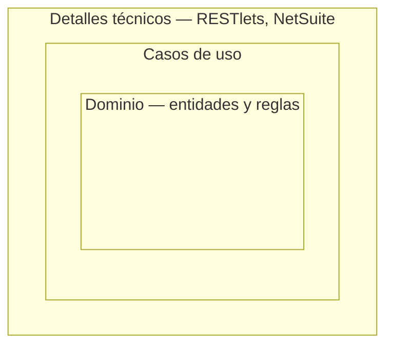
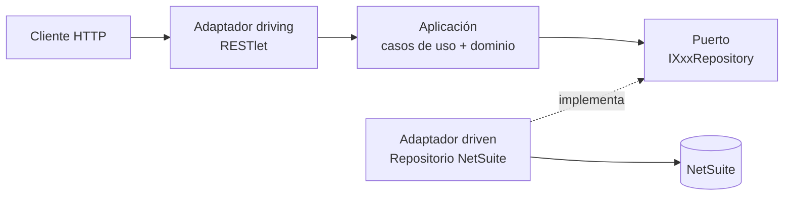
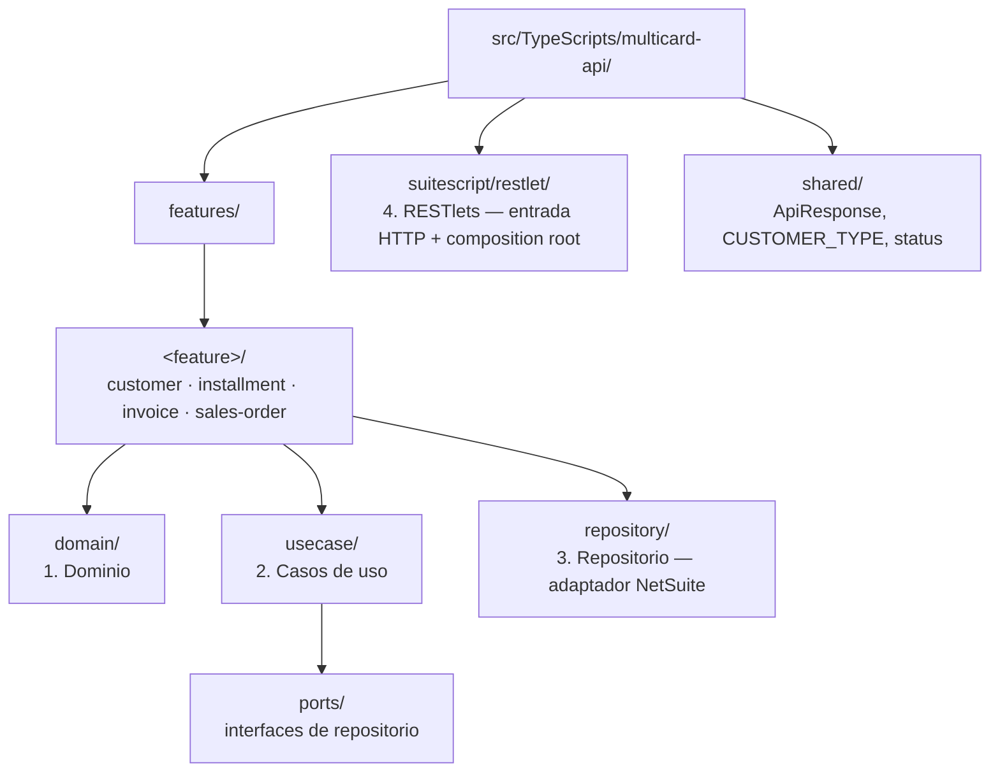
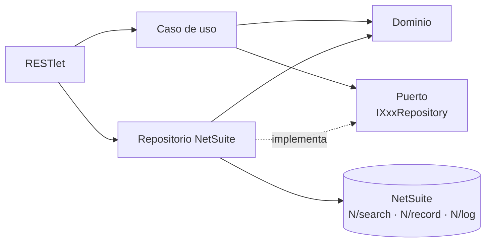
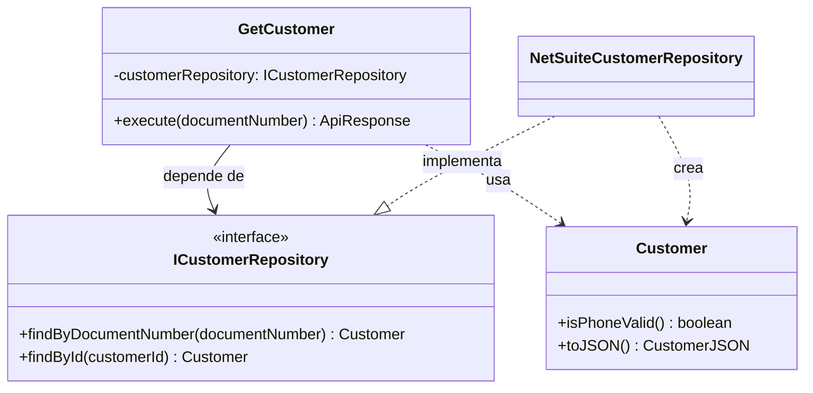
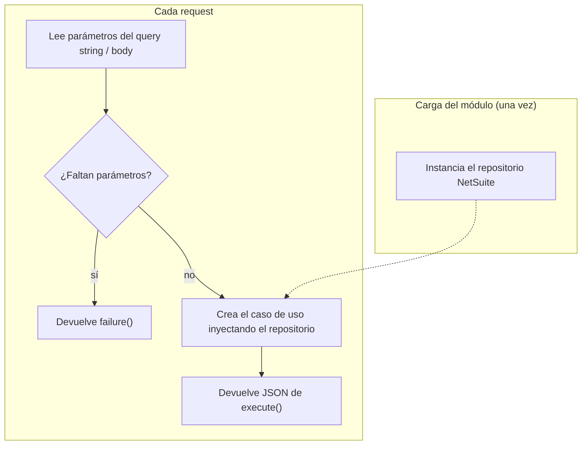
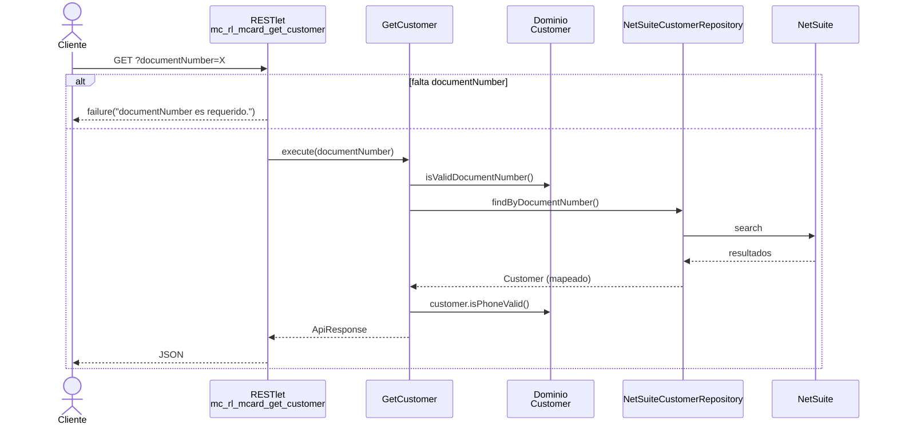

# Resumen de arquitectura — multicard-api

Este documento describe cómo está organizado el código de `multicard-api`, qué responsabilidad tiene cada capa y por qué existe.

> Guía completa: [`.claude/skills/netsuite-clean-architecture/SKILL.md`](../../.claude/skills/netsuite-clean-architecture/SKILL.md). Referencia de endpoints: [`MANUAL.md`](../../MANUAL.md).

## Conceptos base

Antes de ver las capas, conviene tener claros los conceptos sobre los que se apoya la arquitectura.

### Clean Architecture

Organiza el código en capas concéntricas: en el centro están las reglas de negocio y en los bordes los detalles técnicos (base de datos, HTTP, plataforma). La idea central es que **el negocio no dependa de la tecnología**. NetSuite, los RESTlets y las búsquedas son detalles; las reglas de crédito, cuotas y validación de clientes son el negocio.

Usamos una versión **pragmática**: se respeta la regla de dependencia, pero sin agregar capas o abstracciones que no aportan valor en SuiteScript.

### Regla de dependencia

Es la regla más importante: **el código fuente solo puede depender de capas más internas**. Una capa interna nunca importa nada de una capa externa. El dominio no sabe que existe un caso de uso, y el caso de uso no sabe que existe NetSuite.

Si se rompe esta regla, un cambio técnico (por ejemplo, renombrar un campo personalizado) termina rompiendo lógica de negocio que no tenía nada que ver.

### Puertos y adaptadores (arquitectura hexagonal)

- **Puerto:** una interfaz que describe lo que la aplicación necesita del exterior, en términos del negocio. Ejemplo: "buscar un cliente por número de documento" (`ICustomerRepository`).
- **Adaptador:** la implementación concreta que conecta ese puerto con una tecnología real. Ejemplo: `NetSuiteCustomerRepository`, que resuelve esa búsqueda con `N/search`.

Hay dos tipos de adaptadores:

| Tipo | Qué hace | En este proyecto |
| --- | --- | --- |
| **Driving** (de entrada) | Recibe una petición del exterior y llama a la aplicación | RESTlets |
| **Driven** (de salida) | La aplicación lo usa para acceder a datos o servicios externos | Repositorios NetSuite |

### Inversión de dependencias

Normalmente la lógica llamaría directamente a la base de datos y dependería de ella. Aquí se invierte: **el caso de uso declara la interfaz que necesita** (el puerto) y **el repositorio la implementa**. Así la flecha de dependencia apunta desde la infraestructura hacia el negocio, y no al revés.

Por eso, en este proyecto, los puertos viven en `usecase/ports/` y no en `repository/`.

### Inyección de dependencias y composition root

- **Inyección de dependencias:** un caso de uso no crea su repositorio; lo recibe por constructor. Eso permite pasarle la implementación real en producción y un fake en los tests.
- **Composition root:** el único lugar donde se crean las implementaciones concretas y se conectan entre sí. Aquí ese lugar es cada RESTlet.

### Entidad y caso de uso

- **Entidad:** un objeto del negocio con datos y comportamiento propio. Ejemplo: `Customer` sabe si su teléfono es válido.
- **Caso de uso:** una acción concreta que el sistema ofrece. Ejemplo: "obtener cliente por documento" o "generar cuotas". Coordina entidades y puertos para cumplir esa acción.

### Screaming Architecture

La estructura de carpetas debe "gritar" qué hace el sistema, no qué framework usa. Por eso el primer nivel es `features/customer`, `features/installment`, `features/invoice` y `features/sales-order`, y recién dentro de cada uno aparecen las capas técnicas.

### Un RESTlet por caso de uso

Cada endpoint HTTP tiene su propio archivo y su propio despliegue. Es la aplicación del **principio de responsabilidad única** a nivel de endpoint: un cambio o un error en un endpoint no afecta a los demás.

---

## Visión general

El proyecto es una personalización SDF de NetSuite. El código fuente en TypeScript se compila a AMD (SuiteScript 2.1) y se despliega con la SuiteCloud CLI.

Se usa una **Clean Architecture pragmática en 4 capas**, organizada por feature (*screaming architecture*: las carpetas dicen qué hace el sistema, no qué framework usa).

### La regla de dependencia

Las dependencias apuntan **hacia adentro**:

- El dominio no conoce a nadie.
- El caso de uso conoce al dominio y a una **interfaz** (puerto), nunca a NetSuite.
- El repositorio conoce a NetSuite y **implementa** el puerto.
- El RESTlet es el único que conoce a todos: arma las piezas y las conecta.

**¿Por qué?** Porque NetSuite es el detalle más volátil y difícil de probar. Si la lógica de negocio depende de `N/search`, cada regla queda atada a la plataforma: no se puede testear sin stubs y cualquier cambio de campo rompe reglas que nada tienen que ver.

---

## 1. Dominio (`features/<feature>/domain/`)

**Qué contiene:** entidades (clases con propiedades y comportamiento), constantes de negocio y funciones puras.

Ejemplo: `Customer` en `customer.domain.ts` expone `isPhoneValid()` y `toJSON()`; el feature `installment` contiene el cálculo de la tabla de amortización (`buildAmortizationTable`).

Cómo se modela cada pieza del dominio (entidad, cálculo de dominio o read model): ver [`patron-dominio.md`](./patron-dominio.md).

**Reglas:**
- **Cero imports de `N/*`.**
- Solo puede importar desde `shared/`.
- No conoce IDs de campos NetSuite (`custentity_...`).

**¿Por qué la necesitamos?**
- Es el corazón del negocio: las reglas (validar un documento, calcular cuotas, saldo disponible) viven en un solo lugar.
- Al ser código puro, se testea de forma directa y rápida, sin simular NetSuite.
- Si mañana cambia un campo personalizado o la forma de consultar, el dominio no se toca.

---

## 2. Casos de uso (`features/<feature>/usecase/`)

**Qué contiene:** una clase por caso de uso (`GetCustomer`, `ValidateCustomerForPurchase`, `GenerateInstallments`, etc.) con un método `execute(...)`, y los **puertos** en `usecase/ports/`.

**Reglas:**
- Recibe sus dependencias por constructor (inyección de dependencias), siempre tipadas como **interfaces**.
- Orquesta: valida la entrada, llama al repositorio, aplica reglas del dominio y arma la respuesta `ApiResponse<T>` con `success()` / `failure()`.
- Los mensajes para el usuario se escriben en español.
- **El puerto (`IXxxRepository`) se declara aquí, no en el repositorio.** El caso de uso define *qué necesita*; el repositorio se adapta.
- Se permite consumir puertos de otro feature (por ejemplo, `installment` usa `ICustomerRepository`).

**¿Por qué la necesitamos?**
- Separa el *flujo de la aplicación* (qué pasos sigue un endpoint) de las *reglas del negocio* (dominio) y del *acceso a datos* (repositorio).
- Al depender de una interfaz, en los tests se reemplaza el repositorio por un fake y se prueba el flujo completo sin NetSuite.
- Declarar el puerto aquí es lo que invierte la dependencia: el negocio dicta el contrato, la infraestructura obedece.

---

## 3. Repositorio (`features/<feature>/repository/`)

**Qué contiene:** el adaptador de persistencia NetSuite. Ejemplo: `NetSuiteCustomerRepository`, que implementa `ICustomerRepository`.

**Reglas:**
- **Única capa que importa `N/search`, `N/record` y `N/log`.**
- Los IDs de NetSuite (`RECORD_*`, `custentity_...`) viven aquí, en una constante `FIELDS`.
- Un único mapper (`toDomain` / `toCustomer`) convierte el resultado de NetSuite en una entidad de dominio.
- Devuelve entidades de dominio, nunca objetos crudos de `search.Result`.

**¿Por qué la necesitamos?**
- Aísla todo el conocimiento de NetSuite en un solo archivo por feature. Si cambia un campo personalizado, se cambia una línea en `FIELDS`.
- Concentra los detalles técnicos (formateo de teléfono, conversión `'T'` → `true`, redondeo de montos) fuera de la lógica de negocio.
- Es el punto de reemplazo: el caso de uso no sabe si los datos vienen de una búsqueda guardada, de SuiteQL o de un fake de test.

---

## 4. RESTlets (`suitescript/restlet/`)

**Qué contiene:** un archivo `mc_rl_mcard_<verbo_sustantivo>.ts` por caso de uso. Es el *driving adapter* (entrada HTTP) y el **composition root** (donde se conectan las piezas).

**Reglas:**
- **1 RESTlet = 1 caso de uso.** Sin despacho por `?action=`.
- Las entradas vienen del request (query string o body JSON), **no** de parámetros de script SDF.
- Debe comenzar con el header JSDoc `@NApiVersion / @NScriptType / @NModuleScope`, o NetSuite rechaza el deploy.
- No contiene lógica de negocio: parsea, valida presencia de parámetros, instancia y delega.
- Su objeto SDF vive en `src/Objects/restlet/*.xml`.

**¿Por qué la necesitamos?**
- Es el único lugar que conoce las implementaciones concretas; el resto del sistema trabaja contra interfaces.
- Un archivo por endpoint permite despliegues independientes, logs separados en el Execution Log, URLs autoexplicativas y un radio de impacto pequeño ante errores.

---

## `shared/` — tipos transversales

Contiene lo que usan varios features: `ApiResponse<T>` con los helpers `success()` / `failure()` (`response.ts`), `CUSTOMER_TYPE` (`customer-type.ts`) y los códigos de estado (`status.ts`).

**¿Por qué?** Garantiza que todos los endpoints respondan con el mismo contrato `{ success, data, message, error }`, sin duplicar tipos entre features.

---

## Recorrido de un request

`GET ?documentNumber=X` → `mc_rl_mcard_get_customer`:

---

## Notas y deudas conocidas

- En `installment` e `invoice` el puerto todavía se declara dentro del archivo del caso de uso (por ejemplo, `IInvoiceRepository` en `invoice.usecase.ts`) en lugar de `usecase/ports/`, como sí ocurre en `customer` y `sales-order`.
- La tabla de inventario de RESTlets en `README.md` no coincide del todo con los archivos actuales de `suitescript/restlet/`.
- Los tests corren contra el JS compilado: ejecutar `pnpm build` antes de `pnpm test`.
